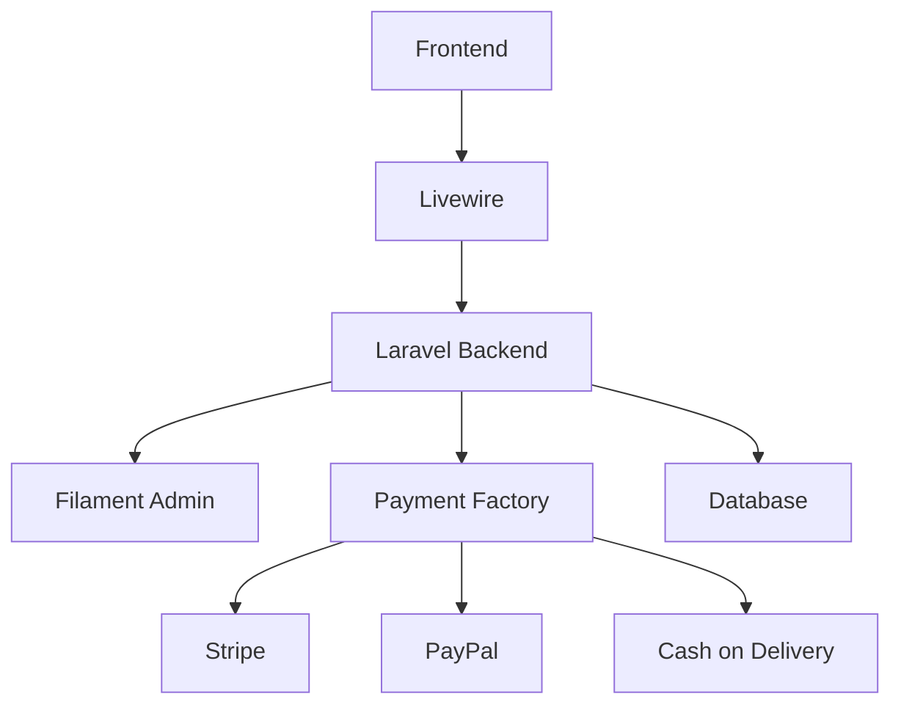
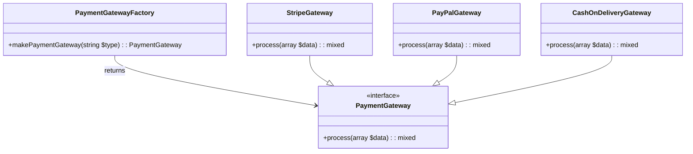

# Food Tracking System
[](https://laravel.com ) [](https://www.php.net ) [](https://developer.mozilla.org/en-US/docs/Web/JavaScript ) [](https://stripe.com ) [](https://www.paypal.com ) [](https://filamentphp.com )

> *A scalable Laravel-based e-commerce logistics solution for food delivery operations.*

---

## Overview

The **Food Tracking System** is a comprehensive platform designed to streamline food delivery logistics using modern web development practices. Built on **Laravel**, it integrates **real-time shipping cost calculation**, **multi-gateway payment processing**, and an intuitive **Filament-powered admin dashboard**.

This system ensures extensibility through architectural patterns like the **Factory Design Pattern**, enabling seamless integration of new payment gateways without modifying existing logic.

---



---

## Key Features

### Admin Control Panel (Built with Filament)

- Manage **shipping zones**, **countries**, and **cities**
- Add and assign roles to **Filament users**
- Control product visibility via **active/inactive status**
- Update **banners** and **featured products**
- Customize **front-end banner texts**

### Real-Time Shipping Calculator (Livewire-Powered)

- Dynamic shipping fee calculation based on selected:
  - Country
  - City
- Instant feedback if shipping is unavailable
- Auto-updates total cost including shipping

### Multi-Gateway Payment Integration (Factory Design Pattern)

Supports multiple payment gateways:
- ✅ Stripe
- ✅ PayPal
- ✅ Cash on Delivery (COD)

Admins can toggle these options dynamically from the dashboard without touching code.

### RESTful APIs

- Retrieve countries and cities via secure API endpoints
- Efficient zone and rate management for scalable logistics

---

## Technologies Used

| Layer       | Technology           |
|------------|----------------------|
| Backend    | Laravel 10+          |
| Frontend   | Livewire + Blade     |
| Admin UI   | FilamentPHP          |
| Database   | MySQL                |
| Payments   | Stripe, PayPal SDKs  |
| Build Tool | Composer, NPM        |

---

## Installation Guide

### Prerequisites

Ensure you have the following installed:

- PHP >= 8.1
- Composer
- MySQL
- Node.js & npm

---

### Steps

```bash
# Clone the repository
git clone https://gitlab.objects.ws/laravel/engy-food-delivery-training.git  
cd engy-food-delivery-training
```

```bash
# Install PHP dependencies
composer install
```

```bash
# Install and build frontend assets
npm install && npm run dev
```

```bash
# Create environment file
cp .env.example .env
```

> Edit `.env` with your database credentials and payment gateway keys.

```bash
# Migrate and seed database
php artisan migrate --seed
```

```bash
# Serve the application
php artisan serve
```

---

## Usage

### Accessing Admin Panel

Navigate to:  
👉 [http://localhost:8000/admin](http://localhost:8000/admin)

### Creating Admin Users

Run this command to create a Filament user:

```bash
php artisan make:filament-user
```

Follow prompts to enter:
- Email address
- Password

User will be added to the Filament admin system.

---

## Payment Management

Administrators can manage payment methods directly from the dashboard:

1. Go to **Settings > Manage Payment**
2. Toggle available methods:
   - Stripe
   - PayPal
   - Cash on Delivery

Changes are applied instantly across the checkout flow.

> 💡 Powered by the **Factory Design Pattern**, this system allows easy addition of new payment gateways in the future.

---

## Factory Design Pattern Architecture

To support dynamic switching between payment gateways, we use the **Factory Design Pattern**, which decouples payment logic from the client code.

### Class Diagram



---

###  How It Works

1. **Client Code** calls `PaymentGatewayFactory::makePaymentGateway($type)` with a type like `'stripe'`, `'paypal'`, or `'cash_on_delivery'`.
2. The **Factory** inspects the type and returns an instance of the corresponding **gateway class**.
3. Each gateway implements the same interface (`PaymentGateway`) and provides its own logic inside the `process()` method.
4. The client can now safely call `process()` without knowing which specific gateway is being used.

---

## Contributing

Contributions are welcome! If you'd like to improve any of these plugins or add new features:

1. Fork the repo
2. Create a feature branch
3. Submit a pull request

